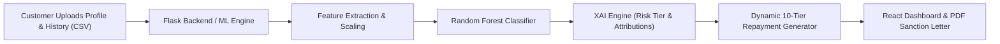

# What is this Project?

The **AI-Driven Smart Repayment Management System** is a full-stack automated credit underwriting and loan appraisal platform. It replaces traditional manual loan verification with machine learning, explainable AI (XAI), and real-time repayment restructuring.

---

## 🔄 System Workflow

---

## 🔑 Key Components

### 1. Machine Learning Model (`backend/models/`)
Evaluates applicant profiles against **7 financial and behavioral metrics**:
- **EMI Amount** (Existing debt obligation)
- **ontime_payment** (Cycles paid on time)
- **offtime_payment** (Cycles delayed/defaulted)
- **loan_count** (Active / historical credit lines)
- **Income** (Monthly net earnings)
- **Average Monthly Expenditure** (Living expenses)
- **Credit Score** (Bureau score 300–900)

### 2. Explainable AI (XAI) Engine (`xai_engine.py`)
- Computes **Probability of Default (PD)** and **Approval Confidence**.
- Calculates directional impact percentages (positive vs. negative) for each financial metric and provides actionable financial recommendations.
- Assigns a dynamic risk tier:
  - **Low Risk** (7.50% APR)
  - **Moderate Risk** (9.50% APR)
  - **High Risk** (12.00% APR)

### 3. Dynamic Repayment Engine (`main.py`)
- Evaluates net disposable income capped at a **30% Debt-to-Income (DTI)** ratio.
- Generates **10 customizable tenures** (12 to 120 months) showing monthly EMI, total interest, and total payable amount.

### 4. PDF Sanction Service (`pdf_service.py`)
- Dynamically compiles an official **PDF Sanction Memorandum** complete with credit audit breakdowns, risk tiers, and authorization blocks using ReportLab.

### 5. Interactive React UI (`frontend/src/`)
- Visual charts, file upload drag-and-drop, interactive loan calculator, model health telemetry modal, and real-time EMI recalculation when borrowers simulate extra monthly principal payments.
