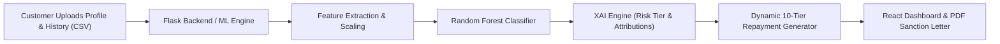

# What is this Project?

The **AI-Driven Smart Repayment Management System** is a full-stack automated credit underwriting and loan appraisal platform. It replaces traditional manual loan verification with machine learning, explainable AI (XAI), and real-time repayment restructuring.

---

## 🔄 System Workflow



---

## 🔑 Key Components

### 1. Machine Learning Model (`backend/models/`)
Evaluates applicant profiles against **7 financial and behavioral metrics**:
- **EMI Amount** (Existing debt obligation)
- **ontime_payment** (Cycles paid on time)
- **offtime_payment** (Cycles delayed/defaulted)
- **loan_count** (Active / historical credit lines)
- **Income** (Monthly net earnings)
- **Average Monthly Expenditure** (Living expenses)
- **Credit Score** (Bureau score 300–900)

### 2. Explainable AI (XAI) Engine (`xai_engine.py`)
- Computes **Probability of Default (PD)** and **Approval Confidence**.
- Calculates directional impact percentages (positive vs. negative) for each financial metric and provides actionable financial recommendations.
- Assigns a dynamic risk tier:
  - **Low Risk** (7.50% APR)
  - **Moderate Risk** (9.50% APR)
  - **High Risk** (12.00% APR)

### 3. Dynamic Repayment Engine (`main.py`)
- Evaluates net disposable income capped at a **30% Debt-to-Income (DTI)** ratio.
- Generates **10 customizable tenures** (12 to 120 months) showing monthly EMI, total interest, and total payable amount.

### 4. PDF Sanction Service (`pdf_service.py`)
- Dynamically compiles an official **PDF Sanction Memorandum** complete with credit audit breakdowns, risk tiers, and authorization blocks using ReportLab.

### 5. Interactive React UI (`frontend/src/`)
- Visual charts, file upload drag-and-drop, interactive loan calculator, model health telemetry modal, and real-time EMI recalculation when borrowers simulate extra monthly principal payments.

---

## 📖 Step-by-Step Tutorial: How to Use This Project

Follow this guide to launch the system and navigate every feature from start to finish.

### Phase 1: Launching the Application

You can access the platform via the **[Live Deployment](https://ai-smart-repayment-system.vercel.app/)** or run it locally:

#### 1. Start the Flask ML API Backend
Open a terminal in the project root:
```bash
cd backend
pip install -r requirements.txt
python main.py
```
> The API server boots at `http://localhost:5000` (database tables and ML models load automatically).

#### 2. Start the React Frontend Dashboard
Open a second terminal:
```bash
cd frontend
npm install
npm start
```
> The web portal opens in your browser at `http://localhost:3000`.

---

### Phase 2: User Authentication

1. **Register an Account**:
   - On the login screen, click **"Create an account"** (or go to `/reg`).
   - Enter your **Full Name**, **Work Email**, **Secure Password**, and select your role (**Credit Officer / Admin**).
   - Click **"Create Account"**.
2. **Log In**:
   - Return to the login portal (`/`), enter your email and password, and submit.
   - Upon successful verification, you are automatically directed to the **Underwriting & XAI Workspace** (`/checkuser`).

---

### Phase 3: Credit Underwriting & AI Risk Appraisal (`/checkuser`)

The appraisal workflow operates in a 3-step wizard:

#### Step 1: Upload Customer Demographic Profile
- In the file drop zone, upload the customer's baseline demographic CSV (e.g., [`backend/static/sample.csv`](file:///d:/Local%20Disk%20(D)/AI-DRIVEN%20SMART%20REPAYMENT%20MANAGEMENT%20SYSTEM/backend/static/sample.csv)).
- This file contains: `Customerid`, `CustomerName`, `Income`, `AverageMonthlyExpenditure`, and `CreditScore`.
- Click **Upload**. Once processed, the wizard transitions to Step 2.

#### Step 2: Upload Historical Loan Records
- In the second drop zone, upload the customer's installment and repayment history CSV (e.g., [`backend/static/sampleloan.csv`](file:///d:/Local%20Disk%20(D)/AI-DRIVEN%20SMART%20REPAYMENT%20MANAGEMENT%20SYSTEM/backend/static/sampleloan.csv)).
- This file contains: `customerid`, `loanno`, `Loan Amount`, `Interest Rate (%)`, `EMI Amount`, `Repayment Period (Months)`, `Outstanding Balance Amount`, `Bank Statement`, and `payment` (1 for on-time, 0 for delayed).
- Click **Upload** to trigger the ML & XAI pipeline.

#### Step 3: Interpret AI Assessment & Explainability (XAI)
Once evaluated, the results dashboard displays:
- **Eligibility Verdict**: `Eligible` or `Not Eligible`.
- **Dynamic Risk Tier Badge**:
  - 🟢 **Low Risk**: Standard base interest rate (7.50% APR).
  - 🟡 **Moderate Risk**: Calibrated risk premium (9.50% APR).
  - 🔴 **High Risk**: Elevated risk buffer (12.00% APR).
- **Probability Scores**: Approval Probability vs. Default Probability (PD).
- **XAI Factor Attributions**:
  - Horizontal breakdown showing each feature's directional impact (e.g., positive impact from high credit score or on-time payments, negative impact from high existing EMI load).
  - Prescriptive financial recommendations based on applicant weak points.

---

### Phase 4: Dynamic Repayment Matrix & Prepayment Simulator

1. **Review 10-Tier Repayment Options**:
   - The system automatically calculates maximum borrowing capacity based on a **30% Debt-to-Income (DTI)** threshold.
   - A comparison matrix shows tenures from **12 to 120 months**, detailing monthly EMI, total interest, and gross repayment amounts.
2. **Select a Preferred Tenure Plan**:
   - Click on any tenure card (e.g., 24 months, 36 months, 60 months) to select it as the active repayment schedule.
3. **Simulate Prepayments / Extra Monthly Contributions**:
   - Scroll to the **Interactive Prepayment Simulator**.
   - Input an additional monthly principal payment (e.g., `2000`).
   - The simulator recalculates in real-time:
     - **Tenure Reduction**: How many months are shaved off the loan.
     - **Interest Saved**: Total currency saved over the loan lifecycle.
     - **Revised Amortization**: New projected payoff schedule.

---

### Phase 5: Generate & Download Official PDF Sanction Memorandum

1. Ensure your desired repayment plan is selected.
2. Click the **"Download Sanction Memorandum (PDF)"** button.
3. The backend generates a publication-grade PDF containing:
   - Official memorandum header and dynamic sanction reference ID.
   - Comprehensive borrower profile and verified income audit.
   - Assessed Risk Tier, Default Probability, and APR terms.
   - Repayment schedule summary and legal authorization/sign-off blocks.
4. The PDF will immediately download to your machine as `Loan_Sanction_Letter_<CustomerID>.pdf`.

---

### Phase 6: Historical Portfolio & Servicing Analytics (`/next`)

1. Click **"Historical Analytics"** in the left sidebar menu (or navigate to `/next`).
2. Enter any historical **Customer ID** (e.g., `101`, `102` or IDs present in the uploaded datasets) and click **Search**.
3. Inspect the comprehensive servicing breakdown:
   - Multi-loan portfolio summary and open facilities.
   - On-time vs. off-time repayment ratios and delinquency flags.
   - Comparative expenditure vs. income ratios.

---

### Phase 7: Model Health & Telemetry Modal

1. In the left sidebar, locate the **Pipeline Status** card.
2. Click **"View Model Health & Metrics"**.
3. A telemetry modal displays live diagnostics from the backend:
   - **Active Model**: `RandomForestClassifier` with `StandardScaler`.
   - **Validation Accuracy**: 100.0% benchmark performance.
   - **Confusion Matrix**: True Positive, True Negative, False Positive, False Negative counts.
   - **Feature Scaling Parameters**: Means and standard deviations for all 7 ingested features.

---

### 🧪 Ready-to-Use Sample Files for Testing

Sample CSV datasets are readily available in the `backend/static/` directory:

| Test Case | Step 1 File (Profile) | Step 2 File (History) | Expected Outcome |
| :--- | :--- | :--- | :--- |
| **Prime Eligible Borrower** | `sample.csv` | `sampleloan.csv` | **Eligible** (Low/Moderate Risk, full 10-tier repayment matrix & PDF unlocked) |
| **High Delinquency / Ineligible** | `samplenot.csv` | `sampleloannot.csv` | **Not Eligible** (High risk, high default probability, remedial advice displayed) |
| **Comprehensive Dataset** | `customer_data.csv` | `customer_loan_data_detailed.csv` | Multi-record batch underwriting & historical search |

